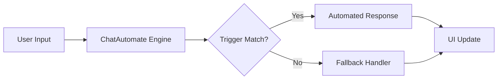

# 🤖 ChatAutomate — Automate Your Conversations, Amplify Your Reach

[](LICENSE)
[](CONTRIBUTING.md)
[]()
[]()

> **Automate 12** — A lightweight, browser-based chat automation toolkit that lets you script, schedule, and supercharge your messaging workflows with zero backend setup.

---

## 🌟 Why This Exists

Manual chat management is a time sink. Whether you're handling customer support, social DMs, or lead generation, repetitive responses eat hours every week. **ChatAutomate** solves this by providing a clean, client-side automation layer that runs entirely in your browser — no servers, no APIs, no complex setup. It's the fastest way to turn your chat into a self-driving conversation engine.

---

## ✨ Key Features

- **⚡ Instant Automation** — Deploy chat scripts with a single HTML file. No dependencies, no build step.
- **🎯 Customizable Triggers** — Define keyword-based responses and scheduled actions.
- **🖥️ Pure Frontend** — Runs 100% client-side; your data stays with you.
- **🔌 Extensible Architecture** — Built with vanilla HTML/CSS/JS, easy to fork and extend.
- **📱 Responsive UI** — Works on desktop and mobile out of the box.
- **🛡️ Privacy-First** — No tracking, no external calls, no data leaks.

---

## 🛠️ Tech Stack & Architecture

| Layer | Technology |
|-------|------------|
| **Frontend** | HTML5, CSS3, JavaScript (ES6) |
| **Storage** | Browser LocalStorage (optional) |
| **Deployment** | Static hosting (GitHub Pages, Netlify, Vercel) |



---

## 📦 Quickstart & Installation

Get up and running in under 60 seconds:

```bash
# Clone the repository
git clone https://github.com/erfanhassan/chatautomate.git

# Navigate into the project
cd chatautomate

# Open the app (macOS)
open index.html

# Or on Windows
start index.html
```

That's it! No npm install, no build tools — just open and automate.

---

## 🖼️ Visual Preview

> Add a screenshot or GIF of your chat interface here. Replace the placeholder below with an actual image from `/assets` or `/screenshots`.


---

## 🤝 Contributing & Community

We welcome contributions of all kinds — bug fixes, feature requests, documentation, or design improvements.

- **Contributing Guide**: See [CONTRIBUTING.md](CONTRIBUTING.md)
- **Code of Conduct**: See [CODE_OF_CONDUCT.md](CODE_OF_CONDUCT.md)
- **Issues**: [Open an issue](https://github.com/erfanhassan/chatautomate/issues) for bugs or suggestions

Let's build the future of chat automation together! 🚀

---

## 📄 License

This project is licensed under the MIT License — see the [LICENSE](LICENSE) file for details.

---

**Star this repo** ⭐ if you find it useful, and share it with your network to help us grow!
